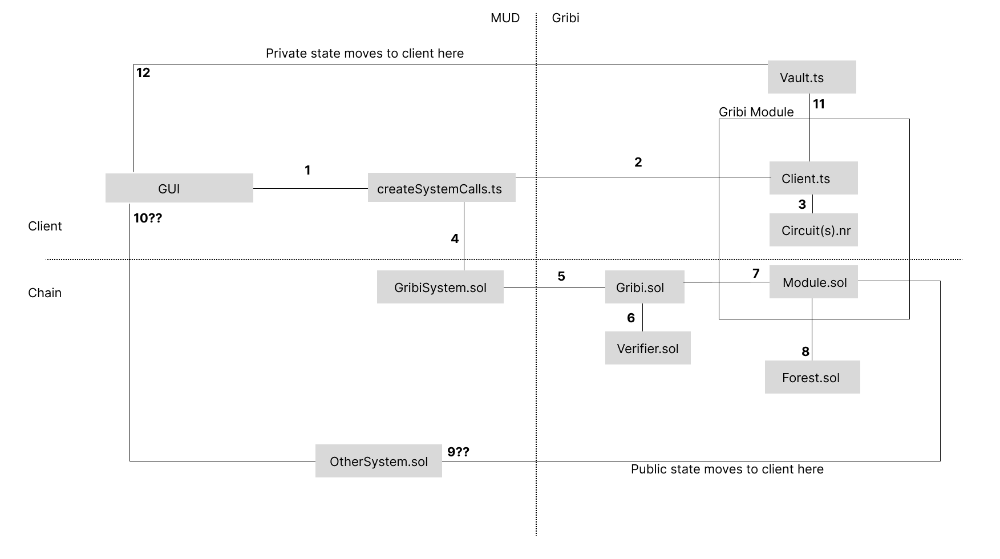

# gribi-playground
A little playground to try out the Gribi interface

Setup
---

### Fetch the Gribi repository, build and create links

```
git submodule update --init
```

```
cd gribi/packages/contracts
pnpm install
forge build
pnpm link --global 
cd -
```

```
cd gribi/packages/gribi-js
pnpm install
pnpm link --global 
cd -
```

```
cd gribi/packages/gribi-mud
pnpm install
pnpm link --global 
cd -
```

```
cd gribi/packages/circuits
pnpm install
pnpm build
cd - 
cd gribi/packages/gribi-js
pnpm install
pnpm build
pnpm link --global
cd gribi/pcakages/gribi-mud
pnpm install
pnpm link --global
```

### Link everything and install 
```
cd playground/game/packages/contracts 
pnpm install
pnpm link --global gribi-contracts
cd -
```

```
cd playground/game/packages/client
pnpm install
pnpm link --global gribi-js
pnpm link --global gribi-mud
cd -
```

### Run the dev setup 
```
cd playground/game
pnpm install
pnpm run dev
```


### Cursed Diagram

