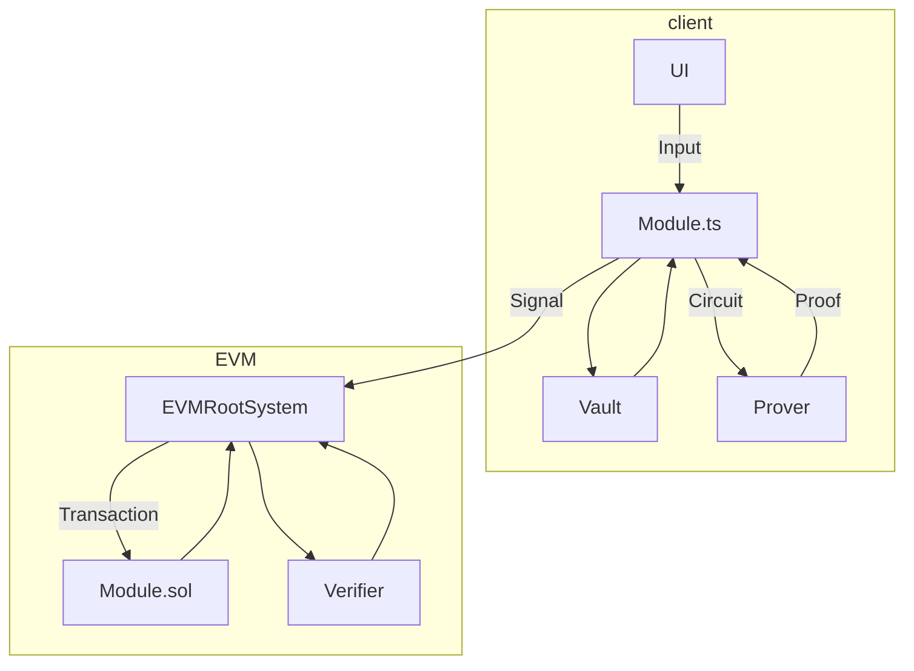

# How to Write a Module

Modules are the building blocks of complex behavior in Gribi. If you want to do something in Gribi, you will either be writing a module or using one. Here we will go through the process of writing a new Gribi module by following the 
example module available in this folder.

## Table of Contents
- [What kind of module are you writing?]()
- [Vault]()
- [RootSystem]()
- [Getting Started]()
    - [EVMRootSystem]()
    - [BaseThread.sol]()
    - [contract/Example.sol]()
    - [circuits/commit/src/main.nr]()
    - [client/src/index.ts]()

## What kind of module are you writing?

Modules may exist as:
1. a set of Transforms
2. an IRootSystem(Transmitters and Receptors) and Transform
3. an IRootSystem(Transmitters and Receptors) and RootSystem mods
4. etc.

Not all modules in Gribi are created equal. The gribi interfaces as defined [here](https://github.com/tonk-gg/gribi/blob/main/packages/types) work at different levels of the stack. This tutorial will cover a special type of module made for hidden information on the EVMRootSystem.


## Getting Started

The rest of this document will follow an example module built for the EVMRootSystem. This module exposes the functionality to create, update, and reveal commitments. A module like this sets the foundation for more complex hidden information modules, like hidden movement.

### EVMRootSystem



## Top level packages
 - circuits <br>*Used to generate proofs of client-side secrets or behavior, EVMRootSystem uses Noir*
 - client <br>*Defines an API for the client-side code. Handles the logic of creating Transactions, generating client-side proofs and submitting them to chain.*
 - contracts <br>*Defines how state is checked and updated in the EVMRootSystem*

We will cover these in reverse order.

### BaseThread.sol

When you want to build a module for the EVMRootSystem, then you must either refer to an existing Thread or create your own. Let's take a look at what exactly a Thread is by examining the abstract BaseThread interface.

We will see how these are used in the Example.sol immediately after.

```solidity
struct UpdateRegister {
    uint code;
    bytes value;
}

abstract contract BaseThread {
    /**
    Threads are stateful, isolated containers for your module. 
    The state they carry is meant to assist in performing cryptographic
    operations across the client and chain. Sometimes you need to move that
    state back into a framework optimized for viewing and manipulating big    
    tables of varied state (for example, MUD). It is expected behavior that 
    after each call, a module will set a unique code and, if this state is 
    relevant for an external framework, fill its register. Relevant here 
    means any state you'd care about doing something other than cryptographic 
    operations.
    */
    uint[] codes;
    UpdateRegister internal register;

    /**

    A forest exposes three different merkle trees. A commitment tree, a nullifier tree and a public state tree. 
    These three trees serve distinct cryptographic purposes.

    1. Commitment trees may be used to hold a commitment to some state (e.g.
    a hash of some private data). Storing commitments in a tree allows us to
    prove facts over this commitment without sharing which commitment
    specifically this fact is about.

    2. Nullifier trees are used to hold nullifiers and are optimized to 
    create proofs that something does not exist in the tree. You can think of 
    nullifiers as a way to prevent double-spends over private state.

    3. A public state tree is used similarly to the commitment tree except 
    its leaves hold public state which is visible to all. This allows us to 
    use public state anonymously in our circuits by proving the state we used
    in the circuit exists in this tree.

    */
    Forest internal forest;

    constructor() {
        forest = new Forest();
    }

    /**
        Every module in EVMRootSystem is given a unique ID. Client code, when using a
        module through the EVMRootSystem will use this ID to route appropriately to the module's Thread.
    */
    function getModuleID() public virtual pure returns (uint256); 

    function peekUpdates() public view returns (UpdateRegister memory) {
        return register;
    }
}
```

### contract/Example.sol

Now take a look at the Example.sol file in our module/contracts folder. We will highlight specific units of code to describe how it's implemented.


```solidity
contract Example is BaseThread {
    /** This Codes enum isn't necessary, it's just to make things more readable
        How this integrates with a MUD system is basically a function
        with one really long set of 'if' statements checking codes and
        then calling parse on the UpdateRegister value for that specific
        module.
    */ 
    enum Codes { UNSET, REVEAL_COMMITMENT }
    constructor() {
        codes = new uint[](2);
        codes[uint(Codes.UNSET)] = 0;
        codes[uint(Codes.REVEAL_COMMITMENT)] = 0;
        register = UpdateRegister(uint(Codes.UNSET), bytes(""));
    }
    
    // Keccak of a string provides for a simple way to define the module ID 
    // which can be easily recreated on the client.
    function getModuleID() public virtual pure override returns (uint256) {
        return uint256(keccak256(abi.encodePacked("example-module")));
    }

    function parse(UpdateRegister memory ur) public pure returns (uint256) {
        if (ur.code == uint(Codes.REVEAL_COMMITMENT)) {
            return abi.decode(ur.value, (uint256));
        }
    }

    // EVMRootSystem Module Threads spend most their time managing
    // their forest
    function createCommitment(Transaction memory transaction) external {
        uint256 commitment = transaction.operations[0].value;
        if (transaction.operations.length > 0) {
            require(!forest.nullifierExists(commitment), "This commitment has been nullified");
            forest.addCommitment(commitment);
        }
    }

    function updateCommitment(Transaction memory transaction) external {
        uint256 commitment = transaction.operations[0].value;
        uint256 nullifier = transaction.operations[0].nullifier;
        if (transaction.operations.length > 0) {
            require(!forest.nullifierExists(commitment), "This commitment has been nullified");
            forest.addCommitment(commitment);
            forest.addNullifier(nullifier);
        }
    }

    function revealCommitment(Transaction memory transaction) external {
        require(transaction.inputs.length > 2, "malformed transaction");
        uint256 commitment = transaction.inputs[0].value;
        uint256 salt = transaction.inputs[1].value;
        uint256 secret = transaction.inputs[2].value;
        uint256 nullifier = transaction.operations[0].nullifer;

        require(forest.commitmentExists(commitment), "This value was not properly committed to earlier!");
        require(!forest.nullifierExists(nullifier), "This value was not properly committed to earlier!");
        forest.addNullifier(nullifier);

        uint256 hash = uint256(keccak256(abi.encodePacked([salt, secret])));
        require(hash == commitment, "The revealed commitment is incorrect");

    /**
        Finally we want to move our secret back into MUD so all players can see 
        the reveal. Values in the register are encoded to allow for arbitrary 
        return types. This means whoever will read the type needs to know the 
        underlying structure of the encoded data. Code is a way to mark the 
        return type. In order to encapsulate the code -> type translation, 
        this module includes an add-on convenience function parse() for 
        parsing data.
    */
        register = UpdateRegister(
            uint(Codes.REVEAL_COMMITMENT),
            abi.encode(secret)
        );
    }
}
```


#### What is a Transaction? 

We can see them defined in the Structs.sol file of EVMRootSystem contracts.

```solidity
struct PublicInput {
    uint256 slot;
    uint256 value;
}

struct Operation {
    uint256 opid;
    uint256 value;
    uint256 nullifier;
}

struct Transaction {
    PublicInput[] inputs;
    Operation[] operations;
}
```

Transactions are simply arrays of PublicInputs and Operations. Circuits are required to take a Transaction as input. The EVMRootSystem expects no more than 8 of each of these arrays. So, we can have a maximum of 8 PublicInputs and 8 Operations in one Transaction.

**Operations**
The meaning of opid, value and nullifier will be specific to your module and are specified by you, the module writer. In this module the opid is not used. Value is the commitment and nullifier is only present when making updates or revealing commitments and is just a copy of the previous commitment.

**PublicInput**
PublicInput has a slot. The slot is used to fetch them from the public tree. The EVMRootSystem will feed these inputs into the circuit verifier. In our Example module you see we use slot 0, which is a special value in EVMRootSystem. It tells the EVMRootSystem to not do a lookup into our tree. As such, PublicInputs at slot 0 allow for arbitrary inputs to pass through.

### circuits/commit/src/main.nr

> NOTE: Circuit logic is currently incomplete and is not turned on in the alpha version EVMRootSystem. 

The EVMRootSystem expects our Circuits to be written in [Noir](), a rust-like circuit definition language.


The interface below describes the public and private inputs to our module circuit in Noir.
```rust
fn main(
	address: pub Field,
	inputs: pub [PublicInput; 8],
	operations: pub [Operation; 8],

	commitment_root: pub Field, 
	nullifier_root: pub Field,
	public_root: pub Field,

	//Arbitrary private variables would go below here
	commitment: Field,
	secrets: Field,
	salt: Field
) { ... }
```

In the future, the address, tree roots, inputs and operations will be handled through oracle calls. We may also need to add extra information into the context. As such, this format is highly likely to change.

The primary thing to note is how our circuit allows for arbitrary private variables. We can add as many private inputs as we want, however the public inputs are fixed. The PublicInputs and Operations fed into this circuit will be the same PublicInputs and Operations sent by the client and received by our contract. 

EVMRootSystem promises to verify the proof with the above inputs, which are again: msg.sender(), Transaction and the roots of the Thread's forest.

Given this construction we can began to see how a circuit might constrain behavior across client and contract.

The client could update a secret commitment to a new secret commitment and prove this update is valid and made according to the constraints of the circuit. Then, the contract only needs to verify a proof and perform the updates as specified by the Transaction.

Let's imagine our commitment is a player's hidden location (x,y) data hashed using Pedersen hash. A player then chooses to move to (x+1, y). This requires an update to the committed Pedersen hash. Our circuit would something like this:
1. Check the new commitment is well formed.
2. Check the new commitment pre-hash (x,y) is within distance 1 of previous commitment pre-hash (x,y)
3. Check the nullifier of the previous commitment is well formed.

### client/src/index.ts

This brings us finally to the module's client code. As above, we will go through the client code and comment on specific logic to cover all the requisite parts of writing client code in Gribi.
<br/>
<br/>

```typescript
import { keccak256, toHex } from 'viem';
import { 
    Signal, 
    Field,
    Receptor,
} from '@gribi/types';
import { WitnessRelation, Precursor } from '@gribi/types';
import { Utils } from "@gribi/vault";
import { EVMRootSystem, StateUpdate, prove } from "@gribi/evm-rootsystem";
import { CompiledCircuit } from '@noir-lang/backend_barretenberg';

import CommitCheck from '../../circuits/commit/target/commit.json';

export const MODULE_ID = BigInt(keccak256(toHex("example-module")));

export type Commitment = string;
export type CommitmentArgs = {
    secret: Field,
    salt: Field,
}

export type StoredCommitment = {
    secret: string[],
    salt: string[],
}

export type UpdateCommitmentArgs = {
    relation: WitnessRelation<Commitment[], StoredCommitment>,
    circuit?: CompiledCircuit,
    secret: Field,
    salt: Field,
}

/**
 * A Precursor is a convenient structure for us to use client-side because it 
 * bundles the claim (the commitment) with its secret parts (the witness). 
 * 
 * We don't use PCDs for this although would be much the same except instead 
 * of a field called 'witness', it would be called 'proof' and would be the
 * the trivial proof.
 * 
 * In order to draw a distinction between this client-side utility form and 
 * regular PCDs which are meant to be federated, Gribi defines the Precursor 
 * interface which takes a 'WitnessRelation' instead.
 * 
 * This CreateCommitment Precursor simply bundles together a commitment with 
 * its witness: a salt and secret (the two values hashed together to create 
 * the commitment).
 */
export class CreateCommitment implements Precursor<CommitmentArgs, Commitment[], StoredCommitment> {
    async bond(args: CommitmentArgs): Promise<WitnessRelation<Commitment[], StoredCommitment>> {
        const commitment = (await Utils.keccak([args.salt as bigint, args.secret as bigint])).toString();
        return {
            claim: [commitment.toString()],
            witness: {
                secret: [args.secret.toString()],
                salt: [args.salt.toString()]
            }
        }
    }
}

export class UpdateCommitment implements Precursor<UpdateCommitmentArgs, Commitment[], StoredCommitment> {
    async bond(args: UpdateCommitmentArgs): Promise<WitnessRelation<Commitment[], StoredCommitment>> {
        const commitment = (await Utils.keccak([args.salt as bigint, args.secret as bigint])).toString();
        return {
            claim: [args.relation.claim.slice(-1)[0], commitment.toString()],
            witness: {
                secret: [args.relation.witness.secret.slice(-1)[0], args.secret.toString()],
                salt: [args.relation.witness.salt.slice(-1)[0], args.salt.toString()]
            }
        }
    }
}

/**
 * The CreateCommitmentReceptor mostly is data munging the various bits
 * of state on our client into a form factor necessary for the EVMRootSystem.
 */ 
export class CreateCommitmentReceptor implements Receptor<WitnessRelation<Commitment[], StoredCommitment>, StateUpdate> {
    async signal(args: WitnessRelation<Commitment[], StoredCommitment>): Promise<Signal<StateUpdate>> {
        let cc = CommitCheck as CompiledCircuit;
        const inputs =  [Utils.EmptyInput()];
        const operations = [{
            opid: 0,
            value: BigInt(args.claim.slice(-1)[0]),
        }];

        // The only other concern beside data munging is to generate
        // the proof. This proof just makes sure the commitment was 
        // done correctly. You can see a sample of that circuit logic
        // in the circuit/ folder.
        const proof = await prove(EVMRootSystem.walletAddress, cc, inputs, operations, {
            secret: args.witness.secret,
            salt: args.witness.salt
        });

        return {
            output: {
                id: MODULE_ID,
                method: 'createCommitment',
                inputs,
                operations,
                proof
            }
        }
    }
}

export class UpdateCommitmentReceptor implements Receptor<UpdateCommitmentArgs, StateUpdate> {
    async signal(args: UpdateCommitmentArgs): Promise<Signal<StateUpdate>> {
        let cc = CommitCheck as CompiledCircuit;
        const inputs = [Utils.EmptyInput()];
        const operations = [
            {
                opid: 0,
                value: BigInt(args.relation.claim[1]),
                nullifier: BigInt(args.relation.claim[0]),
            },
        ];
        const proof = await prove(EVMRootSystem.walletAddress, args.circuit || cc, inputs, operations, {
            secret: args.secret,
            salt: args.salt
        })

        return {
            output: {
                id: MODULE_ID,
                method: 'updateCommitment',
                inputs,
                operations,
                proof
            }
        }
    }
}

export class RevealCommitment implements Receptor<WitnessRelation<Commitment[], StoredCommitment>, StateUpdate> {
    async signal(args: WitnessRelation<Commitment[], StoredCommitment>): Promise<Signal<StateUpdate>> {
        const commitment = args.claim.slice(-1)[0];
        const secret = args.witness.secret.slice(-1)[0];
        const salt = args.witness.salt.slice(-1)[0];
        return {
            output: {
                id: MODULE_ID,
                method: "revealCommitment",
                inputs: [{
                    slot: 0,
                    value: commitment
                }, {
                    slot: 0,
                    value: salt
                }, {
                    slot: 0,
                    value: secret
                }],
                operations: [{
                    opid: 0,
                    nullifier: commitment
                }]
            }
        }
    }
}
```


<br/>


That's it!

But, where's our Transaction actually made? How does this StateUpdate reach the contract? In order to understand that, we'll need to take a look at the [How to Use a Module in MUD](../../game/TUTORIAL.md) tutorial.


